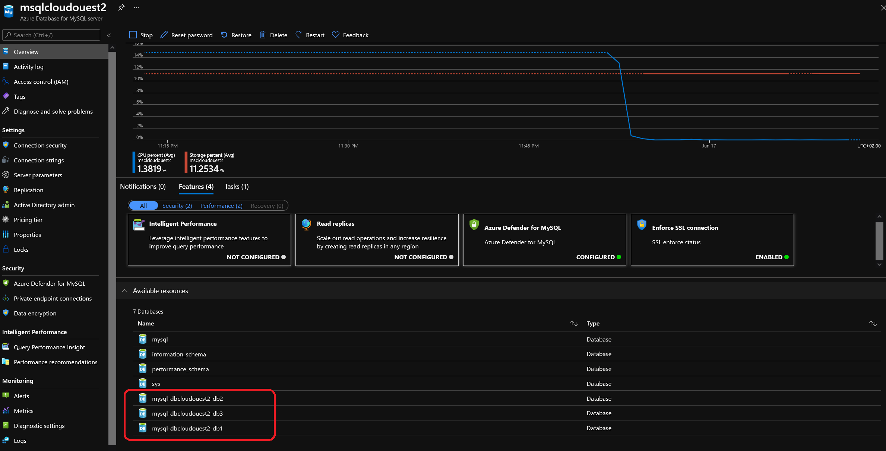

# Azure Database for MySQL Module

## Module description

This module deploys a Azure DataBase for MySQL Server.
It includes configuration for:

- Threat detection
- Azure AD Administrator
- database(s) with a count functionnality
- virtual network rules with a count functionnality

It is also configured to create Azure monitor Alert on the following metrics:

- Database connection threshold
- Database storage threshold
- Database CPU Threshold

In order to send alert, it relies on a existing Azure Action Group.

Lastly, it is configured to send diagnostic to a storage account and a log analytic workspace

### Module inputs

| Variable name | Variable type | Default value | Description |
|:--------------|:--------------|:--------------|:------------|
| MySQLDbList | string | ["defaultdbrws"]| List of MySQL databases names. |
| RGName | string | N/A | The name of the resource group in which the MySQL Server exists. Changing this forces a new resource to be created. |
| MySQLDbCharset | string | "latin2" | Specifies the Charset for the MySQL Database, which needs to be a valid MySQL Charset. Changing this forces a new resource to be created. |
| MySQLDbCollation | string | "latin2_general_ci" | Specifies the Collation for the MySQL Database, which needs to be a valid MySQL Collation. Changing this forces a new resource to be created. |
| MySQLServerName | string | N/A | Specifies the name of the MySQL Server. Changing this forces a new resource to be created. |


## How to call the module

Use as follow:

```bash

module "MySQLDBs" {

  #Module Location
  source                                  = "../../Modules/MySQLDB"

  #Module variable     
  MySQLDbList                             = var.MySQLDbList
  RGName                                  = module.ResourceGroup.RGName
  MySQLServerName                         = module.MySQL.ServerName


}

```

## Sample display

terraform plan should gives the following output:

```powershell

PS C:\Users\jubei.yagyu\statemanip\Terraformconfig\02_Move> terraform plan
=================================Truncated=================================
Terraform used the selected providers to generate the following execution plan. Resource actions are indicated with the following symbols:
  + create

Terraform will perform the following actions:

  # module.MySQLDBs.azurerm_mysql_database.MySQLDB[0] will be created
  + resource "azurerm_mysql_database" "MySQLDB" {
      + charset             = "latin2"
      + collation           = "latin2_general_ci"
      + id                  = (known after apply)
      + name                = "db1"
      + resource_group_name = "rsgcloudouest2"
      + server_name         = "msqlcloudouest2"
    }

  # module.MySQLDBs.azurerm_mysql_database.MySQLDB[1] will be created
  + resource "azurerm_mysql_database" "MySQLDB" {
      + charset             = "latin2"
      + collation           = "latin2_general_ci"
      + id                  = (known after apply)
      + name                = "db2"
      + resource_group_name = "rsgcloudouest2"
      + server_name         = "msqlcloudouest2"
    }

  # module.MySQLDBs.azurerm_mysql_database.MySQLDB[2] will be created
  + resource "azurerm_mysql_database" "MySQLDB" {
      + charset             = "latin2"
      + collation           = "latin2_general_ci"
      + id                  = (known after apply)
      + name                = "db3"
      + resource_group_name = "rsgcloudouest2"
      + server_name         = "msqlcloudouest2"
    }

Plan: 3 to add, 0 to change, 0 to destroy.


```


## Sample deployment

After deployment, something simlilar is visible in the portal:




