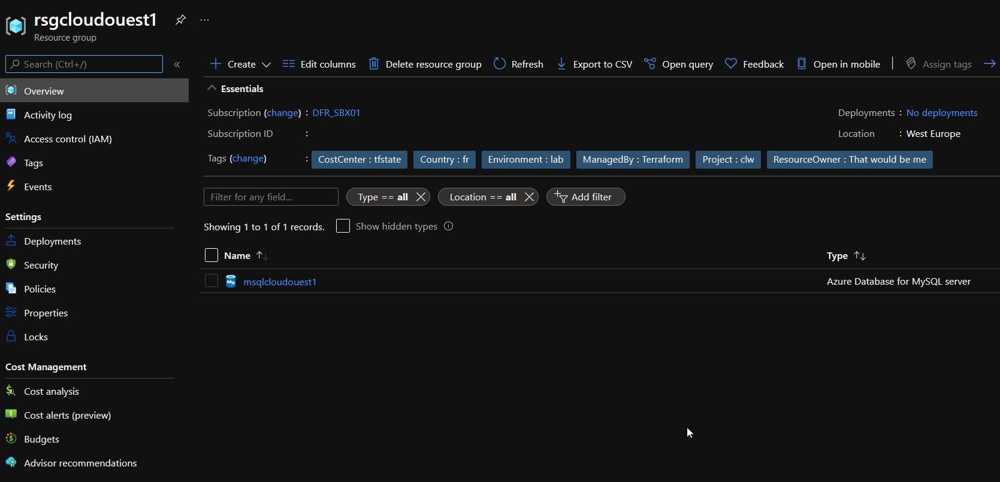
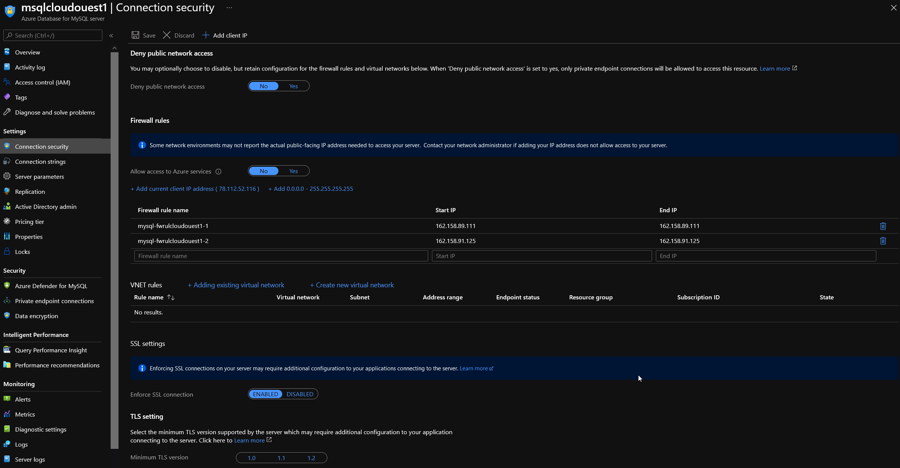
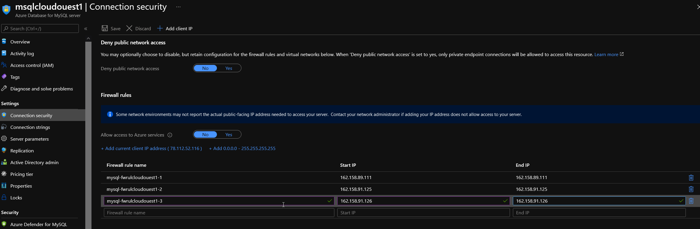

# When your team is not so DevOps

## Scenario description

You built an Azure environment throught terraform with a custom module.
At the end you have this: 

  


  
  

Unfortunately, someone adds a new IP on your server, you know, the IP change so the new one needs to be added, but nobody remember to tell you so it's added directly in the portal T_T:

  

Ok no panic, let's see how to fix it: 

First, we have in this case planned for additional IP, so it's a simple matter.
Disclaimer, it may not be the case and require more reverse engineering, but eh ! it's for a demo right ^^

Let's simply add the new IP in the terraform config:

```bash

module "MySQL" {
  source                              = "github.com/dfrappart/Terra-AZModuletest//Custom_Modules//PaaS_SRVDB_mySql"

=================================Truncated=================================
  
  AllowedPubIPs                        = ["162.158.89.111","162.158.91.125","162.158.91.126"]
  # Monitoring

  ACG1Id                              = data.azurerm_monitor_action_group.SubACG.id

=================================Truncated=================================


}

```

And now let's run a plan: 

```powershell

PS C:\Users\jubei.yagyu\statemanip\Terraformconfig\01_Import> terraform plan 
module.MySQLPWD_to_KV.random_password.TerraRandomPWD: Refreshing state... [id=none]
=================================Truncated=================================

Terraform used the selected providers to generate the following execution plan. Resource actions are indicated with the following symbols:
  + create

Terraform will perform the following actions:

  # module.MySQL.azurerm_mysql_firewall_rule.singleIP[2] will be created
  + resource "azurerm_mysql_firewall_rule" "singleIP" {
      + end_ip_address      = "162.158.91.126"
      + id                  = (known after apply)
      + name                = "mysql-fwrulcloudouest1-3"
      + resource_group_name = "rsgcloudouest1"
      + server_name         = "msqlcloudouest1"
      + start_ip_address    = "162.158.91.126"
    }

Plan: 1 to add, 0 to change, 0 to destroy.

───────────────────────────────────────────────────────────────────────────────────────────────────────────────────

Note: You didn't use the -out option to save this plan, so Terraform can't guarantee to take exactly these actions if you run "terraform apply" now.

```

It's nice because we can plan, but since it already exists, `terraform apply` will fail:

```powershell

module.MySQL.azurerm_mysql_firewall_rule.singleIP[2]: Creating...
╷
│ Error: A resource with the ID "/subscriptions/00000000-0000-0000-0000-000000000000/resourceGroups/rsgcloudouest1/providers/Microsoft.DBforMySQL/servers/msqlcloudouest1/firewallRules/mysql-fwrulcloudouest1-3" already exists - to be managed via Terraform this resource needs to be imported into the State. Please see the resource documentation for "azurerm_mysql_firewall_rule" for more information.
│
│   with module.MySQL.azurerm_mysql_firewall_rule.singleIP[2],
│   on .terraform\modules\MySQL\Custom_Modules\PaaS_SRVDB_mySql\main.tf line 94, in resource "azurerm_mysql_firewall_rule" "singleIP":
│   94: resource "azurerm_mysql_firewall_rule" "singleIP" {
│
╵

```

Right, told you!
So now, we need to import the resource.
We can refer to the <a href="https://www.terraform.io/docs/cli/import/index.html" target="_blank"> **terraform documentation** </a> to have details on the syntax for importation:

```bash

terraform import azurerm_mysql_firewall_rule.rule1 /subscriptions/00000000-0000-0000-0000-000000000000/resourceGroups/mygroup1/providers/Microsoft.DBforMySQL/servers/server1/firewallRules/rule1

```

We could guess the path for the resource in the terraform config, but to be sure, let's use the infamous terraform state command:

```powershell

PS C:\Users\jubei.yagyu\statemanip\Terraformconfig\01_Import> terraform state list
=================================Truncated=================================
module.MySQL.azurerm_mysql_firewall_rule.singleIP[0]
module.MySQL.azurerm_mysql_firewall_rule.singleIP[1]
=================================Truncated=================================

```

In our case, we are adding an object to the list module.MySQL.azurerm_mysql_firewall_rule.singleIP, so the new one will be addressed as module.MySQL.azurerm_mysql_firewall_rule.singleIP[2] (yes index starts at 0).
But let's look at the details, you know, to be hyper sure:

```powershell

PS C:\Users\jubei.yagyu\statemanip\Terraformconfig\01_Import> terraform state show module.MySQL.azurerm_mysql_firewall_rule.singleIP[0]
# module.MySQL.azurerm_mysql_firewall_rule.singleIP[0]:
resource "azurerm_mysql_firewall_rule" "singleIP" {
    end_ip_address      = "162.158.89.111"
    id                  = "/subscriptions/00000000-0000-0000-0000-000000000000/resourceGroups/rsgcloudouest1/providers/Microsoft.DBforMySQL/servers/msqlcloudouest1/firewallRules/mysql-fwrulcloudouest1-1"
    name                = "mysql-fwrulcloudouest1-1"
    resource_group_name = "rsgcloudouest1"
    server_name         = "msqlcloudouest1"
    start_ip_address    = "162.158.89.111"
}

```

Looks good, it seems to have everything wer'e looking for, so now we are going to import the resource, using the proper resource path:

```powershell

PS C:\Users\jubei.yagyu\statemanip\Terraformconfig\01_Import> terraform import module.MySQL.azurerm_mysql_firewall_rule.singleIP[2] "/subscriptions/00000000-0000-0000-0000-000000000000/resourceGroups/rsgcloudouest1/providers/Microsoft.DBforMySQL/servers/msqlcloudouest1/firewallRules/mysql-fwrulcloudouest1-3"
module.MySQL.azurerm_mysql_firewall_rule.singleIP[2]: Importing from ID "/subscriptions/00000000-0000-0000-0000-000000000000/resourceGroups/rsgcloudouest1/providers/Microsoft.DBforMySQL/servers/msqlcloudouest1/firewallRules/mysql-fwrulcloudouest1-3"...
module.MySQL.azurerm_mysql_firewall_rule.singleIP[2]: Import prepared!
  Prepared azurerm_mysql_firewall_rule for import
module.MySQL.azurerm_mysql_firewall_rule.singleIP[2]: Refreshing state... [id=/subscriptions/00000000-0000-0000-0000-000000000000/resourceGroups/rsgcloudouest1/providers/Microsoft.DBforMySQL/servers/msqlcloudouest1/firewallRules/mysql-fwrulcloudouest1-3]

Import successful!

The resources that were imported are shown above. These resources are now in
your Terraform state and will henceforth be managed by Terraform.

```

Now we can run `terraform state list` again: 

```powershell

PS C:\Users\jubei.yagyu\statemanip\Terraformconfig\01_Import> terraform state list
=================================Truncated=================================
module.MySQL.azurerm_mysql_firewall_rule.singleIP[0]
module.MySQL.azurerm_mysql_firewall_rule.singleIP[1]
module.MySQL.azurerm_mysql_firewall_rule.singleIP[2]
=================================Truncated=================================

```


And now a `terraform plan`: 

```powershell

PS C:\Users\jubei.yagyu\statemanip\Terraformconfig\01_Import> terraform plan      
module.MySQLPWD_to_KV.random_password.TerraRandomPWD: Refreshing state... [id=none]
=================================Truncated=================================
module.MySQL.azurerm_mysql_firewall_rule.singleIP[1]: Refreshing state... [id=/subscriptions/00000000-0000-0000-0000-000000000000/resourceGroups/rsgcloudouest1/providers/Microsoft.DBforMySQL/servers/msqlcloudouest1/firewallRules/mysql-fwrulcloudouest1-2]
module.MySQL.azurerm_mysql_firewall_rule.singleIP[0]: Refreshing state... [id=/subscriptions/00000000-0000-0000-0000-000000000000/resourceGroups/rsgcloudouest1/providers/Microsoft.DBforMySQL/servers/msqlcloudouest1/firewallRules/mysql-fwrulcloudouest1-1]
module.MySQL.azurerm_mysql_firewall_rule.singleIP[2]: Refreshing state... [id=/subscriptions/00000000-0000-0000-0000-000000000000/resourceGroups/rsgcloudouest1/providers/Microsoft.DBforMySQL/servers/msqlcloudouest1/firewallRules/mysql-fwrulcloudouest1-3]
=================================Truncated=================================

No changes. Your infrastructure matches the configuration.

Terraform has compared your real infrastructure against your configuration and found no differences, so no changes are needed.

```

And to be sure, a `terraform apply`: 

```powershell

PS C:\Users\jubei.yagyu\statemanip\Terraformconfig\01_Import> terraform apply
module.MySQLPWD_to_KV.random_password.TerraRandomPWD: Refreshing state... [id=none]
module.ResourceGroup.azurerm_resource_group.RG: Refreshing state... [id=/subscriptions/00000000-0000-0000-0000-000000000000/resourceGroups/rsgcloudouest1]
module.MySQLPWD_to_KV.azurerm_key_vault_secret.TerraSecret: Refreshing state... [id=https://akvjun15.vault.azure.net/secrets/kvs-sql/41d1a1f76b8a4a71ab186b8f2bc25b82]
module.MySQL.azurerm_mysql_server.MySQLServer: Refreshing state... [id=/subscriptions/00000000-0000-0000-0000-000000000000/resourceGroups/rsgcloudouest1/providers/Microsoft.DBforMySQL/servers/msqlcloudouest1]
module.MySQL.azurerm_mysql_firewall_rule.singleIP[1]: Refreshing state... [id=/subscriptions/00000000-0000-0000-0000-000000000000/resourceGroups/rsgcloudouest1/providers/Microsoft.DBforMySQL/servers/msqlcloudouest1/firewallRules/mysql-fwrulcloudouest1-2]
module.MySQL.azurerm_mysql_firewall_rule.singleIP[0]: Refreshing state... [id=/subscriptions/00000000-0000-0000-0000-000000000000/resourceGroups/rsgcloudouest1/providers/Microsoft.DBforMySQL/servers/msqlcloudouest1/firewallRules/mysql-fwrulcloudouest1-1]
module.MySQL.azurerm_monitor_metric_alert.DBStorage: Refreshing state... [id=/subscriptions/00000000-0000-0000-0000-000000000000/resourceGroups/rsgcloudouest1/providers/Microsoft.Insights/metricAlerts/malt-DBStorageThreshold-msqlcloudouest1]
module.MySQL.azurerm_mysql_firewall_rule.singleIP[2]: Refreshing state... [id=/subscriptions/00000000-0000-0000-0000-000000000000/resourceGroups/rsgcloudouest1/providers/Microsoft.DBforMySQL/servers/msqlcloudouest1/firewallRules/mysql-fwrulcloudouest1-3]
module.MySQL.azurerm_mysql_active_directory_administrator.MySQLServerADAdmin: Refreshing state... [id=/subscriptions/00000000-0000-0000-0000-000000000000/resourceGroups/rsgcloudouest1/providers/Microsoft.DBforMySQL/servers/msqlcloudouest1/administrators/activeDirectory]
module.MySQL.azurerm_monitor_metric_alert.DBCPU: Refreshing state... [id=/subscriptions/00000000-0000-0000-0000-000000000000/resourceGroups/rsgcloudouest1/providers/Microsoft.Insights/metricAlerts/malt-DBDBCPUThreshold-msqlcloudouest1-DBDBCPUThreshold]
module.MySQL.azurerm_mysql_database.MySQLDB[0]: Refreshing state... [id=/subscriptions/00000000-0000-0000-0000-000000000000/resourceGroups/rsgcloudouest1/providers/Microsoft.DBforMySQL/servers/msqlcloudouest1/databases/mysql-dbcloudouest1-defaultdbrws]
module.MySQL.azurerm_monitor_diagnostic_setting.AzureMSQLDiag: Refreshing state... [id=/subscriptions/00000000-0000-0000-0000-000000000000/resourceGroups/rsgcloudouest1/providers/Microsoft.DBforMySQL/servers/msqlcloudouest1|diag-msqlcloudouest1]
module.MySQL.azurerm_monitor_metric_alert.DBConnectThreshold: Refreshing state... [id=/subscriptions/00000000-0000-0000-0000-000000000000/resourceGroups/rsgcloudouest1/providers/Microsoft.Insights/metricAlerts/malt-DBConnectThreshold-msqlcloudouest1]

No changes. Your infrastructure matches the configuration.

Terraform has compared your real infrastructure against your configuration and found no differences, so no changes are needed.

Apply complete! Resources: 0 added, 0 changed, 0 destroyed.

```