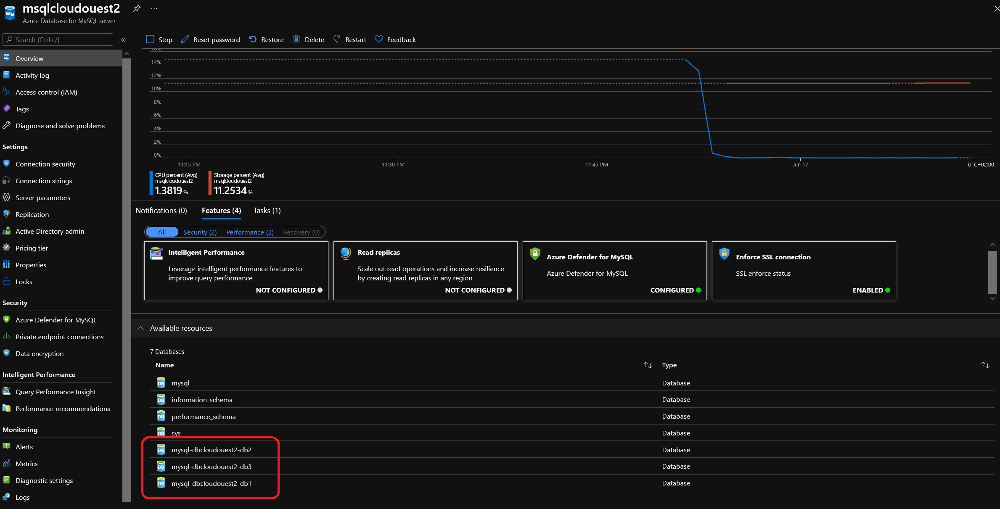
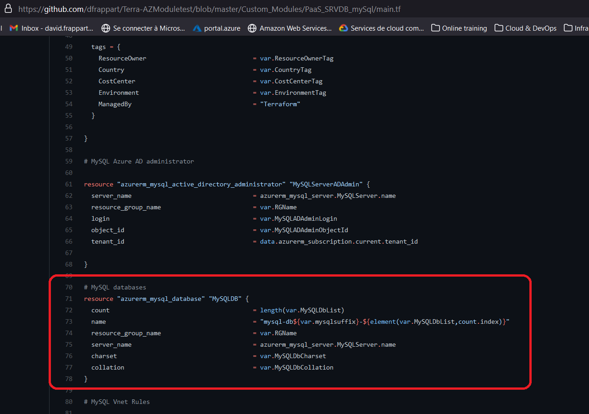

# When you change your lifecycle, because, you know, you and your team have matured in your way of thinking your IaC design

## Scenario description

You built an Azure environment throught terraform with a custom module.
At the end you have this:  
  
  
  
  
  
Now things changed and you and your team have decided to change the lifecycle of the database, which is not inside the <a href="https://github.com/dfrappart/Terra-AZModuletest/blob/master/Custom_Modules/PaaS_SRVDB_mySql/main.tf" target="_blank"> **mysql server module** </a>:  
  
  
  
Let's say we have a module ready to manage databases, a simple thing really, you know, demo stuff... ^^  
  
```bash

###################################################################################
################################### MySQL DB ######################################
###################################################################################


# MySQL databases
resource "azurerm_mysql_database" "MySQLDB" {
  count                                       = length(var.MySQLDbList)
  name                                        = "${element(var.MySQLDbList,count.index)}" 
  resource_group_name                         = var.RGName
  server_name                                 = Var.MySQLServerName
  charset                                     = var.MySQLDbCharset
  collation                                   = var.MySQLDbCollation
}

```

Something that you can call just like that:

```powershell

module "MySQLDBs" {

  #Module Location
  source                                  = "../../Modules/MySQLDB"

  #Module variable     
  MySQLDbList                             = var.MySQLDbList
  RGName                                  = module.ResourceGroup.RGName
  MySQLServerName                         = module.MySQL.ServerName


}

```
  
What happens if we just try a `terraform plan` (well since you're adding a module, you need to run init first, but everyone knows that right ^^):
  
```powershell

PS C:\Users\jubei.yagyu\statemanip\Terraformconfig\02_Move> terraform init
Initializing modules...
- MySQLDBs in ..\..\Modules\MySQLDB

Initializing the backend...

Initializing provider plugins...
- terraform.io/builtin/terraform is built in to Terraform
- Reusing previous version of hashicorp/azuread from the dependency lock file
- Reusing previous version of hashicorp/random from the dependency lock file
- Reusing previous version of hashicorp/azurerm from the dependency lock file
- Using previously-installed hashicorp/azuread v1.5.1
- Using previously-installed hashicorp/random v3.1.0
- Using previously-installed hashicorp/azurerm v2.63.0

Terraform has been successfully initialized!

You may now begin working with Terraform. Try running "terraform plan" to see
any changes that are required for your infrastructure. All Terraform commands
should now work.

If you ever set or change modules or backend configuration for Terraform,
rerun this command to reinitialize your working directory. If you forget, other
commands will detect it and remind you to do so if necessary.

PS C:\Users\jubei.yagyu\statemanip\Terraformconfig\02_Move> terraform plan
=================================Truncated=================================
Terraform used the selected providers to generate the following execution plan. Resource actions are indicated with the following symbols:
  + create

Terraform will perform the following actions:

  # module.MySQLDBs.azurerm_mysql_database.MySQLDB[0] will be created
  + resource "azurerm_mysql_database" "MySQLDB" {
      + charset             = "latin2"
      + collation           = "latin2_general_ci"
      + id                  = (known after apply)
      + name                = "db1"
      + resource_group_name = "rsgcloudouest2"
      + server_name         = "msqlcloudouest2"
    }

  # module.MySQLDBs.azurerm_mysql_database.MySQLDB[1] will be created
  + resource "azurerm_mysql_database" "MySQLDB" {
      + charset             = "latin2"
      + collation           = "latin2_general_ci"
      + id                  = (known after apply)
      + name                = "db2"
      + resource_group_name = "rsgcloudouest2"
      + server_name         = "msqlcloudouest2"
    }

  # module.MySQLDBs.azurerm_mysql_database.MySQLDB[2] will be created
  + resource "azurerm_mysql_database" "MySQLDB" {
      + charset             = "latin2"
      + collation           = "latin2_general_ci"
      + id                  = (known after apply)
      + name                = "db3"
      + resource_group_name = "rsgcloudouest2"
      + server_name         = "msqlcloudouest2"
    }

Plan: 3 to add, 0 to change, 0 to destroy.

```

Looks good, except, well databases already exist right, let's check it with `terraform state list`:

```bash

PS C:\Users\jubei.yagyu\statemanip\Terraformconfig\02_Move> terraform state list
=================================Truncated=================================
module.MySQL.azurerm_mysql_database.MySQLDB[0]
module.MySQL.azurerm_mysql_database.MySQLDB[1]
module.MySQL.azurerm_mysql_database.MySQLDB[2]
module.MySQL.azurerm_mysql_server.MySQLServer
=================================Truncated=================================
```

To be sure, have a look at the details of `module.MySQL.azurerm_mysql_database.MySQLDB[0]`  

```powershell

PS C:\Users\jubei.yagyu\statemanip\Terraformconfig\02_Move> terraform state show module.MySQL.azurerm_mysql_database.MySQLDB[0]
# module.MySQL.azurerm_mysql_database.MySQLDB[0]:
resource "azurerm_mysql_database" "MySQLDB" {
    charset             = "latin2"
    collation           = "latin2_general_ci"
    id                  = "/subscriptions/00000000-0000-0000-0000-000000000000/resourceGroups/rsgcloudouest2/providers/Microsoft.DBforMySQL/servers/msqlcloudouest2/databases/mysql-dbcloudouest2-db1"
    name                = "mysql-dbcloudouest2-db1"
    resource_group_name = "rsgcloudouest2"
    server_name         = "msqlcloudouest2"
}

```
  
And it's the same as the one in the plan, without surprise, except we don't have the resource id yet in the plan:  
  
```powershell

  # module.MySQLDBs.azurerm_mysql_database.MySQLDB[0] will be created
  + resource "azurerm_mysql_database" "MySQLDB" {
      + charset             = "latin2"
      + collation           = "latin2_general_ci"
      + id                  = (known after apply)
      + name                = "db1"
      + resource_group_name = "rsgcloudouest2"
      + server_name         = "msqlcloudouest2"
    }

```
  
Ok, now we have a plan with a set of databases to be created with a new module, except the databases already in the portal and in the state at **another path**.

So this seems a perfect use case for `terraform state mv`

Let's proceed:  
  
```powershell

PS C:\Users\jubei.yagyu\statemanip\Terraformconfig\02_Move> terraform state mv -dry-run module.MySQL.azurerm_mysql_database.MySQLDB[0] module.MySQLDBs.azurerm_mysql_database.MySQLDB[0]
Would move "module.MySQL.azurerm_mysql_database.MySQLDB[0]" to "module.MySQLDBs.azurerm_mysql_database.MySQLDB[0]"

```
  
Looks good, let's try it for real now:  
  
```powershell

PS C:\Users\jubei.yagyu\statemanip\Terraformconfig\01_Import> terraform state list
=================================Truncated=================================
module.MySQLDBs.azurerm_mysql_database.MySQLDB[0]
module.MySQLDBs.azurerm_mysql_database.MySQLDB[1]
module.MySQLDBs.azurerm_mysql_database.MySQLDB[2]
=================================Truncated=================================

```
  
What about a `terraform plan`:  
  
```powershell

PS C:\Users\jubei.yagyu\statemanip\Terraformconfig\01_Import> terraform plan      
module.MySQLPWD_to_KV.random_password.TerraRandomPWD: Refreshing state... [id=none]
module.ResourceGroup.azurerm_resource_group.RG: Refreshing state... [id=/subscriptions/00000000-0000-0000-0000-000000000000/resourceGroups/rsgcloudouest2]
module.MySQLPWD_to_KV.azurerm_key_vault_secret.TerraSecret: Refreshing state... [id=https://akvjun15.vault.azure.net/secrets/kvs-sql2/6178859c5cc74f76a9ba9b56877a4f5d]
module.MySQL.azurerm_mysql_server.MySQLServer: Refreshing state... [id=/subscriptions/00000000-0000-0000-0000-000000000000/resourceGroups/rsgcloudouest2/providers/Microsoft.DBforMySQL/servers/msqlcloudouest2]
module.MySQL.azurerm_mysql_active_directory_administrator.MySQLServerADAdmin: Refreshing state... [id=/subscriptions/00000000-0000-0000-0000-000000000000/resourceGroups/rsgcloudouest2/providers/Microsoft.DBforMySQL/servers/msqlcloudouest2/administrators/activeDirectory]
module.MySQL.azurerm_monitor_metric_alert.DBStorage: Refreshing state... [id=/subscriptions/00000000-0000-0000-0000-000000000000/resourceGroups/rsgcloudouest2/providers/Microsoft.Insights/metricAlerts/malt-DBStorageThreshold-msqlcloudouest2]
module.MySQL.azurerm_monitor_metric_alert.DBCPU: Refreshing state... [id=/subscriptions/00000000-0000-0000-0000-000000000000/resourceGroups/rsgcloudouest2/providers/Microsoft.Insights/metricAlerts/malt-DBDBCPUThreshold-msqlcloudouest2-DBDBCPUThreshold]
module.MySQL.azurerm_monitor_diagnostic_setting.AzureMSQLDiag: Refreshing state... [id=/subscriptions/00000000-0000-0000-0000-000000000000/resourceGroups/rsgcloudouest2/providers/Microsoft.DBforMySQL/servers/msqlcloudouest2|diag-msqlcloudouest2]       
module.MySQLDBs.azurerm_mysql_database.MySQLDB[1]: Refreshing state... [id=/subscriptions/00000000-0000-0000-0000-000000000000/resourceGroups/rsgcloudouest2/providers/Microsoft.DBforMySQL/servers/msqlcloudouest2/databases/mysql-dbcloudouest2-db2]      
module.MySQLDBs.azurerm_mysql_database.MySQLDB[2]: Refreshing state... [id=/subscriptions/00000000-0000-0000-0000-000000000000/resourceGroups/rsgcloudouest2/providers/Microsoft.DBforMySQL/servers/msqlcloudouest2/databases/mysql-dbcloudouest2-db3]      
module.MySQLDBs.azurerm_mysql_database.MySQLDB[0]: Refreshing state... [id=/subscriptions/00000000-0000-0000-0000-000000000000/resourceGroups/rsgcloudouest2/providers/Microsoft.DBforMySQL/servers/msqlcloudouest2/databases/mysql-dbcloudouest2-db1]      
module.MySQL.azurerm_monitor_metric_alert.DBConnectThreshold: Refreshing state... [id=/subscriptions/00000000-0000-0000-0000-000000000000/resourceGroups/rsgcloudouest2/providers/Microsoft.Insights/metricAlerts/malt-DBConnectThreshold-msqlcloudouest2]  

Terraform used the selected providers to generate the following execution plan. Resource actions are indicated with the following symbols:
  + create
-/+ destroy and then create replacement

Terraform will perform the following actions:

  # module.MySQL.azurerm_mysql_database.MySQLDB[0] will be created
  + resource "azurerm_mysql_database" "MySQLDB" {
      + charset             = "latin2"
      + collation           = "latin2_general_ci"
      + id                  = (known after apply)
      + name                = "mysql-dbcloudouest2-db1"
      + resource_group_name = "rsgcloudouest2"
      + server_name         = "msqlcloudouest2"
    }

  # module.MySQL.azurerm_mysql_database.MySQLDB[1] will be created
  + resource "azurerm_mysql_database" "MySQLDB" {
      + charset             = "latin2"
      + collation           = "latin2_general_ci"
      + id                  = (known after apply)
      + name                = "mysql-dbcloudouest2-db2"
      + resource_group_name = "rsgcloudouest2"
      + server_name         = "msqlcloudouest2"
    }

  # module.MySQL.azurerm_mysql_database.MySQLDB[2] will be created
  + resource "azurerm_mysql_database" "MySQLDB" {
      + charset             = "latin2"
      + collation           = "latin2_general_ci"
      + id                  = (known after apply)
      + name                = "mysql-dbcloudouest2-db3"
      + resource_group_name = "rsgcloudouest2"
      + server_name         = "msqlcloudouest2"
    }

  # module.MySQLDBs.azurerm_mysql_database.MySQLDB[0] must be replaced
-/+ resource "azurerm_mysql_database" "MySQLDB" {
      ~ id                  = "/subscriptions/00000000-0000-0000-0000-000000000000/resourceGroups/rsgcloudouest2/providers/Microsoft.DBforMySQL/servers/msqlcloudouest2/databases/mysql-dbcloudouest2-db1" -> (known after apply)
      ~ name                = "mysql-dbcloudouest2-db1" -> "db1" # forces replacement
        # (4 unchanged attributes hidden)
    }

  # module.MySQLDBs.azurerm_mysql_database.MySQLDB[1] must be replaced
-/+ resource "azurerm_mysql_database" "MySQLDB" {
      ~ id                  = "/subscriptions/00000000-0000-0000-0000-000000000000/resourceGroups/rsgcloudouest2/providers/Microsoft.DBforMySQL/servers/msqlcloudouest2/databases/mysql-dbcloudouest2-db2" -> (known after apply)
      ~ name                = "mysql-dbcloudouest2-db2" -> "db2" # forces replacement
        # (4 unchanged attributes hidden)
    }

  # module.MySQLDBs.azurerm_mysql_database.MySQLDB[2] must be replaced
-/+ resource "azurerm_mysql_database" "MySQLDB" {
      ~ id                  = "/subscriptions/00000000-0000-0000-0000-000000000000/resourceGroups/rsgcloudouest2/providers/Microsoft.DBforMySQL/servers/msqlcloudouest2/databases/mysql-dbcloudouest2-db3" -> (known after apply)
      ~ name                = "mysql-dbcloudouest2-db3" -> "db3" # forces replacement
        # (4 unchanged attributes hidden)
    }

Plan: 6 to add, 0 to change, 3 to destroy.

──────────────────────────────────────────────────────────────────────────────────────────────────────────────────────────────────────────────────────────────────────────────────────────────────────── 

Note: You didn't use the -out option to save this plan, so Terraform can't guarantee to take exactly these actions if you run "terraform apply" now.

```
  
Hum!
  
Not so good, let's see why:  

First the server module is still trying to create databases because we did not reflect that in the code. It's a simple matter, just put that in comment:
  
  
  
```powershell

PS C:\Users\jubei.yagyu\statemanip\Terraformconfig\01_Import> terraform plan
module.MySQLPWD_to_KV.random_password.TerraRandomPWD: Refreshing state... [id=none]
module.ResourceGroup.azurerm_resource_group.RG: Refreshing state... [id=/subscriptions/00000000-0000-0000-0000-000000000000/resourceGroups/rsgcloudouest2]
module.MySQLPWD_to_KV.azurerm_key_vault_secret.TerraSecret: Refreshing state... [id=https://akvjun15.vault.azure.net/secrets/kvs-sql2/6178859c5cc74f76a9ba9b56877a4f5d]
module.MySQL.azurerm_mysql_server.MySQLServer: Refreshing state... [id=/subscriptions/00000000-0000-0000-0000-000000000000/resourceGroups/rsgcloudouest2/providers/Microsoft.DBforMySQL/servers/msqlcloudouest2]
module.MySQL.azurerm_mysql_active_directory_administrator.MySQLServerADAdmin: Refreshing state... [id=/subscriptions/00000000-0000-0000-0000-000000000000/resourceGroups/rsgcloudouest2/providers/Microsoft.DBforMySQL/servers/msqlcloudouest2/administrators/activeDirectory]
module.MySQL.azurerm_monitor_metric_alert.DBCPU: Refreshing state... [id=/subscriptions/00000000-0000-0000-0000-000000000000/resourceGroups/rsgcloudouest2/providers/Microsoft.Insights/metricAlerts/malt-DBDBCPUThreshold-msqlcloudouest2-DBDBCPUThreshold]
module.MySQL.azurerm_monitor_diagnostic_setting.AzureMSQLDiag: Refreshing state... [id=/subscriptions/00000000-0000-0000-0000-000000000000/resourceGroups/rsgcloudouest2/providers/Microsoft.DBforMySQL/servers/msqlcloudouest2|diag-msqlcloudouest2]
module.MySQLDBs.azurerm_mysql_database.MySQLDB[1]: Refreshing state... [id=/subscriptions/00000000-0000-0000-0000-000000000000/resourceGroups/rsgcloudouest2/providers/Microsoft.DBforMySQL/servers/msqlcloudouest2/databases/mysql-dbcloudouest2-db2]
module.MySQLDBs.azurerm_mysql_database.MySQLDB[0]: Refreshing state... [id=/subscriptions/00000000-0000-0000-0000-000000000000/resourceGroups/rsgcloudouest2/providers/Microsoft.DBforMySQL/servers/msqlcloudouest2/databases/mysql-dbcloudouest2-db1]
module.MySQLDBs.azurerm_mysql_database.MySQLDB[2]: Refreshing state... [id=/subscriptions/00000000-0000-0000-0000-000000000000/resourceGroups/rsgcloudouest2/providers/Microsoft.DBforMySQL/servers/msqlcloudouest2/databases/mysql-dbcloudouest2-db3]
module.MySQL.azurerm_monitor_metric_alert.DBStorage: Refreshing state... [id=/subscriptions/00000000-0000-0000-0000-000000000000/resourceGroups/rsgcloudouest2/providers/Microsoft.Insights/metricAlerts/malt-DBStorageThreshold-msqlcloudouest2]
module.MySQL.azurerm_monitor_metric_alert.DBConnectThreshold: Refreshing state... [id=/subscriptions/00000000-0000-0000-0000-000000000000/resourceGroups/rsgcloudouest2/providers/Microsoft.Insights/metricAlerts/malt-DBConnectThreshold-msqlcloudouest2]

Terraform used the selected providers to generate the following execution plan. Resource actions are indicated with the following symbols:
-/+ destroy and then create replacement

Terraform will perform the following actions:

  # module.MySQLDBs.azurerm_mysql_database.MySQLDB[0] must be replaced
-/+ resource "azurerm_mysql_database" "MySQLDB" {
      ~ id                  = "/subscriptions/00000000-0000-0000-0000-000000000000/resourceGroups/rsgcloudouest2/providers/Microsoft.DBforMySQL/servers/msqlcloudouest2/databases/mysql-dbcloudouest2-db1" -> (known after apply)
      ~ name                = "mysql-dbcloudouest2-db1" -> "db1" # forces replacement
        # (4 unchanged attributes hidden)
    }

  # module.MySQLDBs.azurerm_mysql_database.MySQLDB[1] must be replaced
-/+ resource "azurerm_mysql_database" "MySQLDB" {
      ~ id                  = "/subscriptions/00000000-0000-0000-0000-000000000000/resourceGroups/rsgcloudouest2/providers/Microsoft.DBforMySQL/servers/msqlcloudouest2/databases/mysql-dbcloudouest2-db2" -> (known after apply)
      ~ name                = "mysql-dbcloudouest2-db2" -> "db2" # forces replacement
        # (4 unchanged attributes hidden)
    }

  # module.MySQLDBs.azurerm_mysql_database.MySQLDB[2] must be replaced
-/+ resource "azurerm_mysql_database" "MySQLDB" {
      ~ id                  = "/subscriptions/00000000-0000-0000-0000-000000000000/resourceGroups/rsgcloudouest2/providers/Microsoft.DBforMySQL/servers/msqlcloudouest2/databases/mysql-dbcloudouest2-db3" -> (known after apply)
      ~ name                = "mysql-dbcloudouest2-db3" -> "db3" # forces replacement
        # (4 unchanged attributes hidden)
    }

Plan: 3 to add, 0 to change, 3 to destroy.

```
  
Much better, only 3 changes, but that's because the databases names are changing, we can fix it easily like that:  
  
  
  
And now the great moment:  
  
```powershell

PS C:\Users\jubei.yagyu\statemanip\Terraformconfig\01_Import> terraform plan
module.MySQLPWD_to_KV.random_password.TerraRandomPWD: Refreshing state... [id=none]
module.ResourceGroup.azurerm_resource_group.RG: Refreshing state... [id=/subscriptions/00000000-0000-0000-0000-000000000000/resourceGroups/rsgcloudouest2]
module.MySQLPWD_to_KV.azurerm_key_vault_secret.TerraSecret: Refreshing state... [id=https://akvjun15.vault.azure.net/secrets/kvs-sql2/6178859c5cc74f76a9ba9b56877a4f5d]
module.MySQL.azurerm_mysql_server.MySQLServer: Refreshing state... [id=/subscriptions/00000000-0000-0000-0000-000000000000/resourceGroups/rsgcloudouest2/providers/Microsoft.DBforMySQL/servers/msqlcloudouest2]
module.MySQL.azurerm_mysql_active_directory_administrator.MySQLServerADAdmin: Refreshing state... [id=/subscriptions/00000000-0000-0000-0000-000000000000/resourceGroups/rsgcloudouest2/providers/Microsoft.DBforMySQL/servers/msqlcloudouest2/administrators/activeDirectory]
module.MySQL.azurerm_monitor_metric_alert.DBCPU: Refreshing state... [id=/subscriptions/00000000-0000-0000-0000-000000000000/resourceGroups/rsgcloudouest2/providers/Microsoft.Insights/metricAlerts/malt-DBDBCPUThreshold-msqlcloudouest2-DBDBCPUThreshold]
module.MySQLDBs.azurerm_mysql_database.MySQLDB[2]: Refreshing state... [id=/subscriptions/00000000-0000-0000-0000-000000000000/resourceGroups/rsgcloudouest2/providers/Microsoft.DBforMySQL/servers/msqlcloudouest2/databases/mysql-dbcloudouest2-db3]
module.MySQLDBs.azurerm_mysql_database.MySQLDB[0]: Refreshing state... [id=/subscriptions/00000000-0000-0000-0000-000000000000/resourceGroups/rsgcloudouest2/providers/Microsoft.DBforMySQL/servers/msqlcloudouest2/databases/mysql-dbcloudouest2-db1]
module.MySQLDBs.azurerm_mysql_database.MySQLDB[1]: Refreshing state... [id=/subscriptions/00000000-0000-0000-0000-000000000000/resourceGroups/rsgcloudouest2/providers/Microsoft.DBforMySQL/servers/msqlcloudouest2/databases/mysql-dbcloudouest2-db2]
module.MySQL.azurerm_monitor_metric_alert.DBStorage: Refreshing state... [id=/subscriptions/00000000-0000-0000-0000-000000000000/resourceGroups/rsgcloudouest2/providers/Microsoft.Insights/metricAlerts/malt-DBStorageThreshold-msqlcloudouest2]
module.MySQL.azurerm_monitor_metric_alert.DBConnectThreshold: Refreshing state... [id=/subscriptions/00000000-0000-0000-0000-000000000000/resourceGroups/rsgcloudouest2/providers/Microsoft.Insights/metricAlerts/malt-DBConnectThreshold-msqlcloudouest2]
module.MySQL.azurerm_monitor_diagnostic_setting.AzureMSQLDiag: Refreshing state... [id=/subscriptions/00000000-0000-0000-0000-000000000000/resourceGroups/rsgcloudouest2/providers/Microsoft.DBforMySQL/servers/msqlcloudouest2|diag-msqlcloudouest2]

No changes. Your infrastructure matches the configuration.

Terraform has compared your real infrastructure against your configuration and found no differences, so no changes are needed.

```
  
and again, just run a `terraform apply`  
  
```powershell

module.MySQLPWD_to_KV.random_password.TerraRandomPWD: Refreshing state... [id=none]
module.ResourceGroup.azurerm_resource_group.RG: Refreshing state... [id=/subscriptions/00000000-0000-0000-0000-000000000000/resourceGroups/rsgcloudouest2]
module.MySQLPWD_to_KV.azurerm_key_vault_secret.TerraSecret: Refreshing state... [id=https://akvjun15.vault.azure.net/secrets/kvs-sql2/6178859c5cc74f76a9ba9b56877a4f5d]
module.MySQL.azurerm_mysql_server.MySQLServer: Refreshing state... [id=/subscriptions/00000000-0000-0000-0000-000000000000/resourceGroups/rsgcloudouest2/providers/Microsoft.DBforMySQL/servers/msqlcloudouest2]
module.MySQL.azurerm_mysql_active_directory_administrator.MySQLServerADAdmin: Refreshing state... [id=/subscriptions/00000000-0000-0000-0000-000000000000/resourceGroups/rsgcloudouest2/providers/Microsoft.DBforMySQL/servers/msqlcloudouest2/administrators/activeDirectory]
module.MySQL.azurerm_monitor_metric_alert.DBCPU: Refreshing state... [id=/subscriptions/00000000-0000-0000-0000-000000000000/resourceGroups/rsgcloudouest2/providers/Microsoft.Insights/metricAlerts/malt-DBDBCPUThreshold-msqlcloudouest2-DBDBCPUThreshold]
module.MySQLDBs.azurerm_mysql_database.MySQLDB[0]: Refreshing state... [id=/subscriptions/00000000-0000-0000-0000-000000000000/resourceGroups/rsgcloudouest2/providers/Microsoft.DBforMySQL/servers/msqlcloudouest2/databases/mysql-dbcloudouest2-db1]      
module.MySQLDBs.azurerm_mysql_database.MySQLDB[1]: Refreshing state... [id=/subscriptions/00000000-0000-0000-0000-000000000000/resourceGroups/rsgcloudouest2/providers/Microsoft.DBforMySQL/servers/msqlcloudouest2/databases/mysql-dbcloudouest2-db2]      
module.MySQLDBs.azurerm_mysql_database.MySQLDB[2]: Refreshing state... [id=/subscriptions/00000000-0000-0000-0000-000000000000/resourceGroups/rsgcloudouest2/providers/Microsoft.DBforMySQL/servers/msqlcloudouest2/databases/mysql-dbcloudouest2-db3]      
module.MySQL.azurerm_monitor_metric_alert.DBStorage: Refreshing state... [id=/subscriptions/00000000-0000-0000-0000-000000000000/resourceGroups/rsgcloudouest2/providers/Microsoft.Insights/metricAlerts/malt-DBStorageThreshold-msqlcloudouest2]
module.MySQL.azurerm_monitor_diagnostic_setting.AzureMSQLDiag: Refreshing state... [id=/subscriptions/00000000-0000-0000-0000-000000000000/resourceGroups/rsgcloudouest2/providers/Microsoft.DBforMySQL/servers/msqlcloudouest2|diag-msqlcloudouest2]       
module.MySQL.azurerm_monitor_metric_alert.DBConnectThreshold: Refreshing state... [id=/subscriptions/00000000-0000-0000-0000-000000000000/resourceGroups/rsgcloudouest2/providers/Microsoft.Insights/metricAlerts/malt-DBConnectThreshold-msqlcloudouest2]  

No changes. Your infrastructure matches the configuration.

Terraform has compared your real infrastructure against your configuration and found no differences, so no changes are needed.

Apply complete! Resources: 0 added, 0 changed, 0 destroyed.

```
